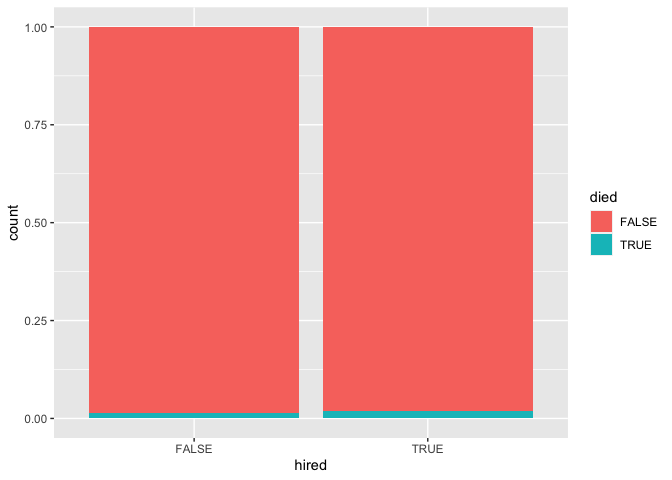

Himalayan climbing expeditions
================
Mine Çetinkaya-Rundel
24 September 2020

    library(tidyverse)
    library(skimr)

The data come from
[TidyTuesday](https://github.com/rfordatascience/tidytuesday/blob/master/data/2020/2020-09-22/readme.md).
TidyTuesday is a weekly social data project for the R community. Read
more about TidyTuesday
[here](https://github.com/rfordatascience/tidytuesday) and see people’s
contributions on Twitter under the [\#tidytuesday
hashtag](https://twitter.com/search?q=tidytuesday&src=typed_query).

    members     <- read_csv("https://raw.githubusercontent.com/rfordatascience/tidytuesday/master/data/2020/2020-09-22/members.csv")
    expeditions <- read_csv("https://raw.githubusercontent.com/rfordatascience/tidytuesday/master/data/2020/2020-09-22/expeditions.csv")
    peaks       <- read_csv("https://raw.githubusercontent.com/rfordatascience/tidytuesday/master/data/2020/2020-09-22/peaks.csv")

Data overview
-------------

### Members

    skim(members)

|                                                  |         |
|:-------------------------------------------------|:--------|
| Name                                             | members |
| Number of rows                                   | 76519   |
| Number of columns                                | 21      |
| \_\_\_\_\_\_\_\_\_\_\_\_\_\_\_\_\_\_\_\_\_\_\_   |         |
| Column type frequency:                           |         |
| character                                        | 10      |
| logical                                          | 6       |
| numeric                                          | 5       |
| \_\_\_\_\_\_\_\_\_\_\_\_\_\_\_\_\_\_\_\_\_\_\_\_ |         |
| Group variables                                  | None    |

Data summary

**Variable type: character**

| skim\_variable   | n\_missing | complete\_rate | min | max | empty | n\_unique | whitespace |
|:-----------------|-----------:|---------------:|----:|----:|------:|----------:|-----------:|
| expedition\_id   |          0 |           1.00 |   9 |   9 |     0 |     10350 |          0 |
| member\_id       |          0 |           1.00 |  12 |  12 |     0 |     76518 |          0 |
| peak\_id         |          0 |           1.00 |   4 |   4 |     0 |       391 |          0 |
| peak\_name       |         15 |           1.00 |   4 |  25 |     0 |       390 |          0 |
| season           |          0 |           1.00 |   6 |   7 |     0 |         5 |          0 |
| sex              |          2 |           1.00 |   1 |   1 |     0 |         2 |          0 |
| citizenship      |         10 |           1.00 |   2 |  23 |     0 |       212 |          0 |
| expedition\_role |         21 |           1.00 |   4 |  25 |     0 |       524 |          0 |
| death\_cause     |      75413 |           0.01 |   3 |  27 |     0 |        12 |          0 |
| injury\_type     |      74807 |           0.02 |   3 |  27 |     0 |        11 |          0 |

**Variable type: logical**

| skim\_variable | n\_missing | complete\_rate | mean | count                  |
|:---------------|-----------:|---------------:|-----:|:-----------------------|
| hired          |          0 |              1 | 0.21 | FAL: 60788, TRU: 15731 |
| success        |          0 |              1 | 0.38 | FAL: 47320, TRU: 29199 |
| solo           |          0 |              1 | 0.00 | FAL: 76398, TRU: 121   |
| oxygen\_used   |          0 |              1 | 0.24 | FAL: 58286, TRU: 18233 |
| died           |          0 |              1 | 0.01 | FAL: 75413, TRU: 1106  |
| injured        |          0 |              1 | 0.02 | FAL: 74806, TRU: 1713  |

**Variable type: numeric**

| skim\_variable         | n\_missing | complete\_rate |    mean |      sd |   p0 |  p25 |  p50 |  p75 | p100 | hist  |
|:-----------------------|-----------:|---------------:|--------:|--------:|-----:|-----:|-----:|-----:|-----:|:------|
| year                   |          0 |           1.00 | 2000.36 |   14.78 | 1905 | 1991 | 2004 | 2012 | 2019 | ▁▁▁▃▇ |
| age                    |       3497 |           0.95 |   37.33 |   10.40 |    7 |   29 |   36 |   44 |   85 | ▁▇▅▁▁ |
| highpoint\_metres      |      21833 |           0.71 | 7470.68 | 1040.06 | 3800 | 6700 | 7400 | 8400 | 8850 | ▁▁▆▃▇ |
| death\_height\_metres  |      75451 |           0.01 | 6592.85 | 1308.19 |  400 | 5800 | 6600 | 7550 | 8830 | ▁▁▂▇▆ |
| injury\_height\_metres |      75510 |           0.01 | 7049.91 | 1214.24 |  400 | 6200 | 7100 | 8000 | 8880 | ▁▁▂▇▇ |

### Peaks

    skim(peaks)

|                                                  |       |
|:-------------------------------------------------|:------|
| Name                                             | peaks |
| Number of rows                                   | 468   |
| Number of columns                                | 8     |
| \_\_\_\_\_\_\_\_\_\_\_\_\_\_\_\_\_\_\_\_\_\_\_   |       |
| Column type frequency:                           |       |
| character                                        | 6     |
| numeric                                          | 2     |
| \_\_\_\_\_\_\_\_\_\_\_\_\_\_\_\_\_\_\_\_\_\_\_\_ |       |
| Group variables                                  | None  |

Data summary

**Variable type: character**

| skim\_variable                | n\_missing | complete\_rate | min | max | empty | n\_unique | whitespace |
|:------------------------------|-----------:|---------------:|----:|----:|------:|----------:|-----------:|
| peak\_id                      |          0 |           1.00 |   4 |   4 |     0 |       468 |          0 |
| peak\_name                    |          0 |           1.00 |   4 |  25 |     0 |       468 |          0 |
| peak\_alternative\_name       |        223 |           0.52 |   5 |  49 |     0 |       242 |          0 |
| climbing\_status              |          0 |           1.00 |   7 |   9 |     0 |         2 |          0 |
| first\_ascent\_country        |        132 |           0.72 |   2 |  44 |     0 |        77 |          0 |
| first\_ascent\_expedition\_id |        135 |           0.71 |   9 |   9 |     0 |       332 |          0 |

**Variable type: numeric**

| skim\_variable      | n\_missing | complete\_rate |    mean |     sd |   p0 |     p25 |    p50 |  p75 | p100 | hist  |
|:--------------------|-----------:|---------------:|--------:|-------:|-----:|--------:|-------:|-----:|-----:|:------|
| height\_metres      |          0 |           1.00 | 6656.64 | 571.91 | 5407 | 6235.75 | 6559.5 | 6911 | 8850 | ▂▇▃▁▁ |
| first\_ascent\_year |        132 |           0.72 | 1979.08 | 100.21 |  201 | 1963.00 | 1982.0 | 2008 | 2019 | ▁▁▁▁▇ |

Popular peaks
-------------

    members %>%
      count(peak_name) %>%
      arrange(desc(n)) %>%
      mutate(proportion = n / sum(n))

    ## # A tibble: 391 x 3
    ##    peak_name        n proportion
    ##    <chr>        <int>      <dbl>
    ##  1 Everest      21813     0.285 
    ##  2 Cho Oyu       8890     0.116 
    ##  3 Ama Dablam    8406     0.110 
    ##  4 Manaslu       4593     0.0600
    ##  5 Dhaulagiri I  2592     0.0339
    ##  6 Makalu        2405     0.0314
    ##  7 Lhotse        2379     0.0311
    ##  8 Baruntse      2190     0.0286
    ##  9 Pumori        1780     0.0233
    ## 10 Annapurna I   1669     0.0218
    ## # … with 381 more rows

Hired and died
--------------

    members %>%
      count(hired, died) %>%
      group_by(hired) %>%
      mutate(proportion = n / sum(n))

    ## # A tibble: 4 x 4
    ## # Groups:   hired [2]
    ##   hired died      n proportion
    ##   <lgl> <lgl> <int>      <dbl>
    ## 1 FALSE FALSE 60000     0.987 
    ## 2 FALSE TRUE    788     0.0130
    ## 3 TRUE  FALSE 15413     0.980 
    ## 4 TRUE  TRUE    318     0.0202

    ggplot(members, aes(x = hired, fill = died)) +
      geom_bar(position = "fill")

<!-- -->

Go to RStudio Cloud and try it yourself in the project titled
`Code Along 01 - Himalayan Climbing Expeditions`.
