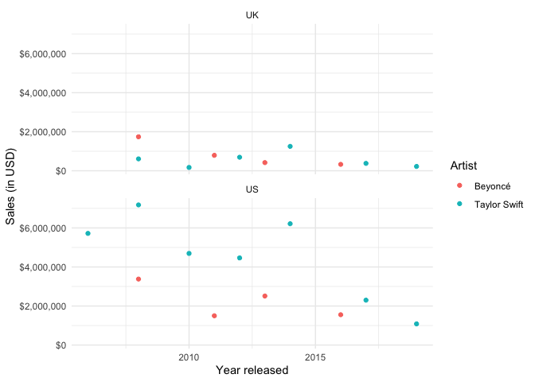
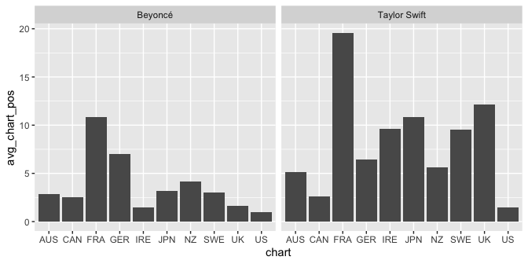
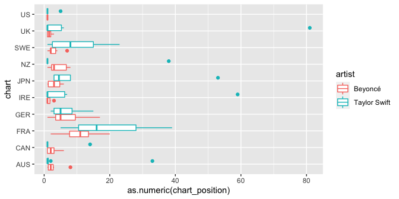
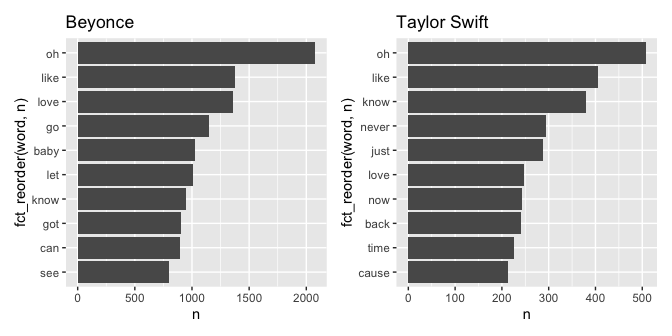

Beyoncé and Taylor Swift Lyrics
================
2020-10-01

    library(tidyverse)
    library(skimr)
    library(tidytext)  # for working with text data
    library(lubridate) # for working with dates
    library(scales)    # for scales on plots 
    library(patchwork) # for arranging plots

The data come from
[TidyTuesday](https://github.com/rfordatascience/tidytuesday/blob/master/data/2020/2020-09-29/readme.md).
TidyTuesday is a weekly social data project for the R community. Read
more about TidyTuesday
[here](https://github.com/rfordatascience/tidytuesday) and see people’s
contributions on Twitter under the [\#tidytuesday
hashtag](https://twitter.com/search?q=tidytuesday&src=typed_query).

    beyonce_lyrics <- read_csv('https://raw.githubusercontent.com/rfordatascience/tidytuesday/master/data/2020/2020-09-29/beyonce_lyrics.csv')
    tswift_lyrics  <- read_csv('https://raw.githubusercontent.com/rfordatascience/tidytuesday/master/data/2020/2020-09-29/taylor_swift_lyrics.csv')
    sales          <- read_csv('https://raw.githubusercontent.com/rfordatascience/tidytuesday/master/data/2020/2020-09-29/sales.csv')
    charts         <- read_csv('https://raw.githubusercontent.com/rfordatascience/tidytuesday/master/data/2020/2020-09-29/charts.csv')

Data overview
-------------

    skim(sales)

|                                                  |       |
|:-------------------------------------------------|:------|
| Name                                             | sales |
| Number of rows                                   | 48    |
| Number of columns                                | 8     |
| \_\_\_\_\_\_\_\_\_\_\_\_\_\_\_\_\_\_\_\_\_\_\_   |       |
| Column type frequency:                           |       |
| character                                        | 7     |
| numeric                                          | 1     |
| \_\_\_\_\_\_\_\_\_\_\_\_\_\_\_\_\_\_\_\_\_\_\_\_ |       |
| Group variables                                  | None  |

Data summary

**Variable type: character**

| skim\_variable | n\_missing | complete\_rate | min | max | empty | n\_unique | whitespace |
|:---------------|-----------:|---------------:|----:|----:|------:|----------:|-----------:|
| artist         |          0 |           1.00 |   7 |  12 |     0 |         2 |          0 |
| title          |          0 |           1.00 |   1 |  20 |     0 |        14 |          0 |
| country        |          1 |           0.98 |   2 |   5 |     0 |         9 |          0 |
| released       |          0 |           1.00 |  13 |  26 |     0 |        14 |          0 |
| re\_release    |         43 |           0.10 |  18 |  20 |     0 |         2 |          0 |
| label          |          0 |           1.00 |   8 |  26 |     0 |         6 |          0 |
| formats        |          0 |           1.00 |  20 |  76 |     0 |         9 |          0 |

**Variable type: numeric**

| skim\_variable | n\_missing | complete\_rate |    mean |      sd |   p0 |    p25 |     p50 |     p75 |    p100 | hist  |
|:---------------|-----------:|---------------:|--------:|--------:|-----:|-------:|--------:|--------:|--------:|:------|
| sales          |          1 |           0.98 | 2873009 | 3203005 | 5700 | 353000 | 1500000 | 4847000 | 1.2e+07 | ▇▂▂▁▁ |

    skim(charts)

|                                                  |        |
|:-------------------------------------------------|:-------|
| Name                                             | charts |
| Number of rows                                   | 140    |
| Number of columns                                | 8      |
| \_\_\_\_\_\_\_\_\_\_\_\_\_\_\_\_\_\_\_\_\_\_\_   |        |
| Column type frequency:                           |        |
| character                                        | 8      |
| \_\_\_\_\_\_\_\_\_\_\_\_\_\_\_\_\_\_\_\_\_\_\_\_ |        |
| Group variables                                  | None   |

Data summary

**Variable type: character**

| skim\_variable  | n\_missing | complete\_rate | min | max | empty | n\_unique | whitespace |
|:----------------|-----------:|---------------:|----:|----:|------:|----------:|-----------:|
| artist          |          0 |           1.00 |   7 |  12 |     0 |         2 |          0 |
| title           |          0 |           1.00 |   1 |  20 |     0 |        14 |          0 |
| released        |          0 |           1.00 |  13 |  26 |     0 |        14 |          0 |
| re\_release     |        120 |           0.14 |  18 |  20 |     0 |         2 |          0 |
| label           |          0 |           1.00 |   8 |  26 |     0 |         6 |          0 |
| formats         |          0 |           1.00 |  20 |  76 |     0 |         9 |          0 |
| chart           |          0 |           1.00 |   2 |   3 |     0 |        10 |          0 |
| chart\_position |          0 |           1.00 |   1 |   2 |     0 |        28 |          0 |

Sales
-----

#### Sales by artist and country over time

    sales %>%
      filter(country == "UK" | country == "US") %>%
      ggplot(aes(y = sales, x = year(mdy(released)), color = artist)) +
      geom_point() +
      facet_wrap(~country, nrow = 2) +
      theme_minimal() +
      scale_y_continuous(labels = label_dollar()) +
      labs(
        x = "Year released",
        y = "Sales (in USD)",
        color = "Artist"
      )

    ## Warning: 4 failed to parse.

    ## Warning: 4 failed to parse.

    ## Warning: Removed 4 rows containing missing values (geom_point).

<!-- -->

Charts
------

### Average chart position by artist and country

    charts %>%
      group_by(artist, chart) %>%
      summarise(avg_chart_pos = mean(as.numeric(chart_position), na.rm = TRUE)) %>%
      ggplot(aes(x = chart, y = avg_chart_pos)) +
      geom_col() +
      facet_wrap(~artist)

    ## `summarise()` regrouping output by 'artist' (override with `.groups` argument)

### Chart position by artist and country

    ggplot(charts, aes(y = chart, x = as.numeric(chart_position), color = artist)) +
      geom_boxplot()

What’s that one Taylor Swift album that did so badly in the UK?

    charts %>%
      filter(as.numeric(chart_position) > 80) %>%
      select(artist, title)

    ## # A tibble: 1 x 2
    ##   artist       title       
    ##   <chr>        <chr>       
    ## 1 Taylor Swift Taylor Swift

Text analysis
-------------

### Common words in Beyonce and Taylor Swift lyrics

    p1 <- beyonce_lyrics %>%
      unnest_tokens(word, line) %>%
      anti_join(get_stopwords()) %>%
      count(word, sort = TRUE) %>%
      slice_max(n, n = 10) %>%
      ggplot(aes(y = fct_reorder(word, n), x = n)) +
      geom_col() +
      labs(title = "Beyonce")

    ## Joining, by = "word"

    p2 <- tswift_lyrics %>%
      unnest_tokens(word, Lyrics) %>%
      anti_join(get_stopwords()) %>%
      count(word, sort = TRUE) %>%
      slice_max(n, n = 10) %>%
      ggplot(aes(y = fct_reorder(word, n), x = n)) +
      geom_col() +
      labs(title = "Taylor Swift")

    ## Joining, by = "word"

    p1 + p2

