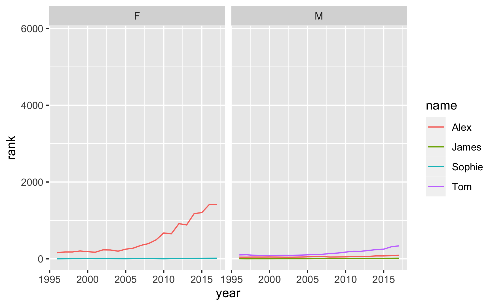
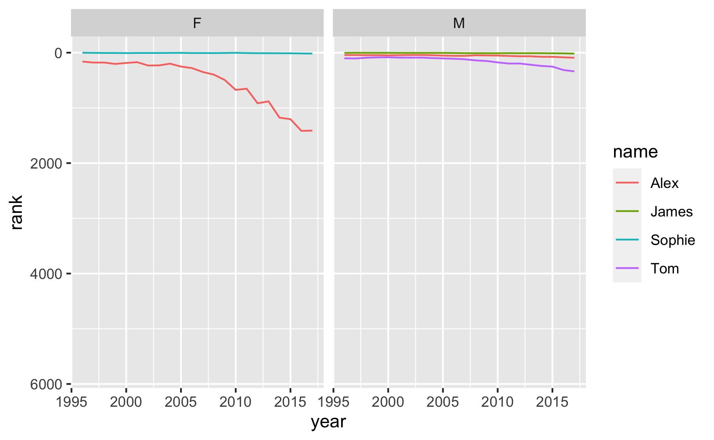
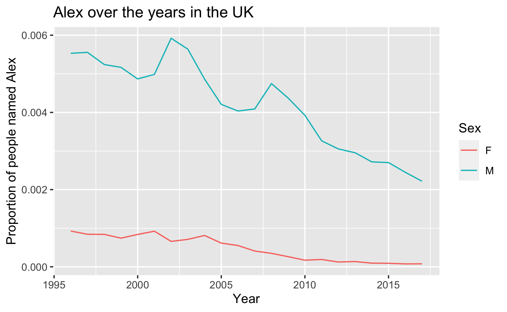
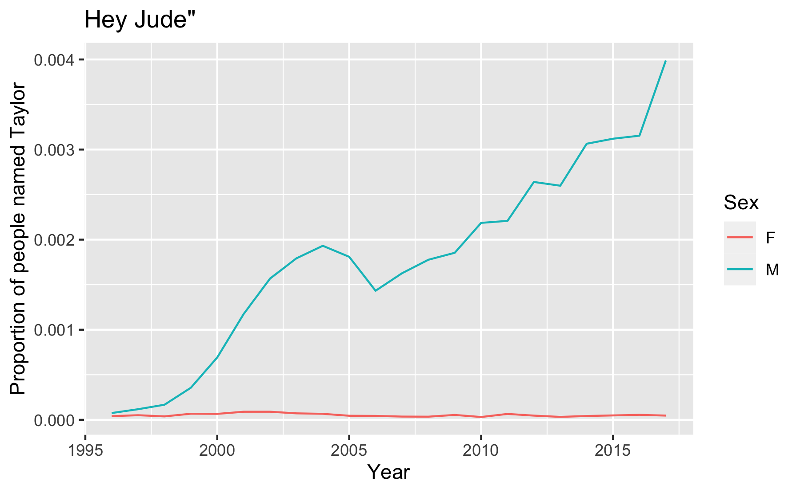
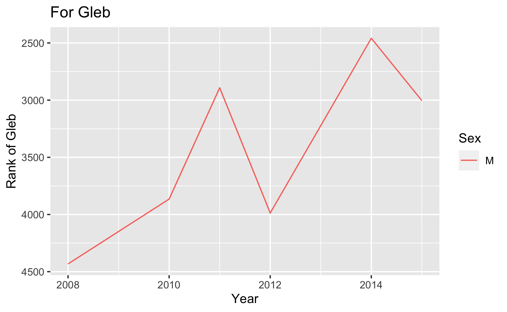

UK Baby Names
================

``` r
library(tidyverse)
library(ukbabynames)
```

## Data

We’ll work with the
[**ukbabynames**](https://github.com/mine-cetinkaya-rundel/ukbabynames)
package, which has two data sets:

-   `ukbabynames`: Full baby name 1996-2017 for the United Kingdom from
    the Office of National Statistics
-   `rankings`: A longitudinal dataset containing the top-100 baby girl
    and top-100 baby boy names over the period 1904 to 1994.

Let’s save these data as tibble to make them easier to work with.

``` r
ukbabynames <- as_tibble(ukbabynames)
rankings <- as_tibble(rankings)
```

Using this dataset, we can, for example, take a look at how popular a
particular name has been over the years.

## Most popular first names in IDS

The most popular first names in IDS are as follows:

    first_name     n
    Alex           4
    James          3
    Sophie         3
    Tom            3

Let’s see how these names fared over time in the UK.

``` r
popular_IDS_names <- c("Alex", "James", "Sophie", "Tom")

ukbabynames %>%
  filter(name %in% popular_IDS_names) %>%
  ggplot(aes(x = year, y = rank, color = name)) +
  geom_line() +
  facet_wrap(~sex)
```



What does a higher rank mean? More or less popular? How can we represent
this better on the plot?

``` r
ukbabynames %>%
  filter(name %in% popular_IDS_names) %>%
  ggplot(aes(x = year, y = rank, color = name)) +
  geom_line() +
  facet_wrap(~sex) +
  scale_y_reverse()
```



Why does the y-axis go up until 6000? How can we fix this?

``` r
ukbabynames %>%
  filter(name %in% popular_IDS_names) %>%
  arrange(desc(rank))
```

    ## # A tibble: 111 x 5
    ##     year sex   name      n  rank
    ##    <dbl> <chr> <chr> <dbl> <dbl>
    ##  1  2016 F     James     3  5785
    ##  2  2016 F     Alex     23  1416
    ##  3  2017 F     Alex     23  1411
    ##  4  2015 F     Alex     28  1204
    ##  5  2014 F     Alex     29  1177
    ##  6  2012 F     Alex     40   916
    ##  7  2013 F     Alex     42   882
    ##  8  2010 F     Alex     55   674
    ##  9  2011 F     Alex     61   652
    ## 10  2009 F     Alex     82   495
    ## # … with 101 more rows

``` r
ukbabynames %>%
  filter(name %in% popular_IDS_names) %>%
  filter(!(name == "James" & sex == "F")) %>% # take out single James in females
  ggplot(aes(x = year, y = rank, color = name)) +
  geom_line() +
  facet_wrap(~sex) +
  scale_y_reverse()
```


## Coding style

As we analyse the data further, we’ll give pointers on coding style.

So first, a mini-lesson on coding style!

> “Good coding style is like correct punctuation: you can manage without
> it, butitsuremakesthingseasiertoread.”
>
> Hadley Wickham

We’ll use the [Tidyverse style guide](http://style.tidyverse.org/).
There’s more to it than what we’ll cover today, but we’ll mention more
as we introduce more functionality, and do a recap later in the
semester.

### File names and code chunk labels

-   Do not use spaces in file names, use `-` or `_` to separate words
-   Use all lowercase letters

``` r
# Good
uk-baby-names.csv

# Bad
UK Baby Names.csv
```

## Object names

-   Use `_` to separate words in object names
-   Use informative but short object names
-   Do not reuse object names within an analysis

``` r
# Good
ukbabynames_2017 <- ukbabynames %>% 
  filter(year == 2017)
```

``` r
# Bad
ukbabynames.2017
ukbabynames2
ukbabynames_subset
ukbabynames_subsetted_for_2017
```

## Spacing

-   Put a space before and after all infix operators (`=`, `+`, `-`,
    `<-`, etc.), and when naming arguments in function calls.
-   Always put a space after a comma, and never before (just like in
    regular English).

``` r
# Good
alex <- ukbabynames %>% 
  group_by(year, sex) %>%
  mutate(prop = n / sum(n)) %>%
  filter(name == "Alex")
```

``` r
# Bad
alex<-ukbabynames%>% 
  group_by(year,sex)%>%
  mutate(prop=n/sum( n ))%>%
  filter(name=="Alex")
```

## ggplot

-   Always end a line with `+`
-   Always indent the next line

``` r
# Good
ggplot(alex, aes(x = year, y = prop, color = sex, group = sex)) +
  geom_line() +
  labs(
    x = "Year",
    y = "Proportion of people named Alex",
    color = "Sex",
    title = "Alex over the years in the UK"
  )
```



`{alex-plot-bad-formatting, eval = FALSE} # Bad ggplot(alex,aes(x=year,y = prop,color=sex,group=sex))+geom_line()+   labs(x = "Year",y = "Proportion of people named Alex",color = "Sex",title = "Alex over the years in the UK")`

## Long lines

-   Limit your code to 80 characters per line. This fits comfortably on
    a printed page with a reasonably sized font.

-   Take advantage of RStudio editor’s auto formatting for indentation
    at line breaks.

`{alex-plot-bad-formatting-long-lines, eval = FALSE} # Bad ggplot(alex,aes(x=year,y = prop,color=sex,group=sex))+geom_line()+labs(x = "Year",y = "Proportion of people named Alex",color = "Sex",title = "Alex over the years in the UK")`

## Assignment

Use `<-` not `=`

``` r
# Good
jude <- ukbabynames %>% 
  group_by(year, sex) %>%
  mutate(prop = n / sum(n)) %>%
  filter(name == "Jude")
```

``` r
# Bad
taylor = ukbabynames %>% 
  group_by(year, sex) %>%
  mutate(prop = n / sum(n)) %>%
  filter(name == "Taylor")
```

## Quotes

Use `"`, not `'`, for quoting text. The only exception is when the text
already contains double quotes and no single quotes.

``` r
ggplot(jude, aes(x = year, y = prop, color = sex, group = sex)) +
  geom_line() +
  labs(
    x = "Year",
    y = "Proportion of people named Taylor",
    color = "Sex",
    title = 'Hey Jude"'
  )
```



## When was the last person called Gary born

In this dataset, what is the birth year of the youngest person named
Gary?

``` r
ukbabynames %>%
  filter(name == "Gary") %>%
  arrange(desc(year))
```

    ## # A tibble: 22 x 5
    ##     year sex   name      n  rank
    ##    <dbl> <chr> <chr> <dbl> <dbl>
    ##  1  2017 M     Gary     26  1097
    ##  2  2016 M     Gary     27  1050
    ##  3  2015 M     Gary     23  1159
    ##  4  2014 M     Gary     33   889
    ##  5  2013 M     Gary     28  1001
    ##  6  2012 M     Gary     29   977
    ##  7  2011 M     Gary     26  1024
    ##  8  2010 M     Gary     32   897
    ##  9  2009 M     Gary     57   576
    ## 10  2008 M     Gary     39   746
    ## # … with 12 more rows

## Few more names

``` r
ukbabynames %>% 
  filter(name == "Gleb") %>%
  ggplot(aes(x = year, y = rank, color = sex, group = sex)) +
  geom_line() +
  labs(
    x = "Year",
    y = "Rank of Gleb",
    color = "Sex",
    title = "For Gleb"
  ) +
  scale_y_reverse()
```


