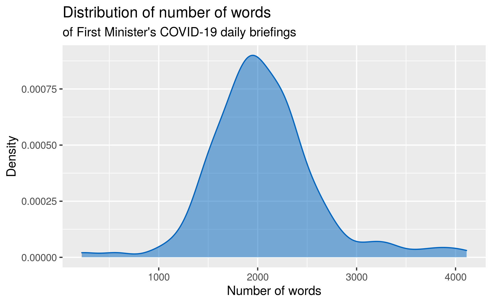

Analysis of First Minister’s COVID-19 Speeches
================

## Days of the week

``` r
covid_speeches <- covid_speeches %>%
  mutate(wday = wday(date, label = TRUE)) 
```

``` r
ggplot(covid_speeches, aes(x = wday)) +
  geom_bar(fill = scotblue)
```


## Length of speech

``` r
covid_speeches <- covid_speeches %>%
  rowwise() %>%
  mutate(
    n_paragraphs = unlist(text) %>% length(),
    n_words      = unlist(text) %>% str_count("\\w+") %>% sum()
  ) %>%
  ungroup()
```

``` r
ggplot(covid_speeches, aes(x = n_words)) +
  geom_density(color = scotblue, fill = scotblue, alpha = 0.5) +
  labs(
    title = "Distribution of number of words",
    subtitle = "of First Minister's COVID-19 daily briefings",
    x = "Number of words",
    y = "Density"
  )
```



``` r
ggplot(covid_speeches, aes(x = date, y = n_words)) +
  geom_point(color = scotblue, alpha = 0.7) +
  geom_smooth(method = "lm", color = "darkgray") +
  labs(
    title = "Length of First Minister's COVID-19 daily briefings",
    subtitle = "Measured in number of words",
    x = NULL, y = "Number of words", color = NULL, shape = NULL
  )
```


## Social vs. physical distancing

``` r
covid_speeches <- covid_speeches %>%
  rowwise() %>%
  mutate(
    social = unlist(text) %>% str_detect("social dist") %>% any(),
    physical = unlist(text) %>% str_detect("physical dist") %>% any()
  ) %>%
  ungroup() %>%
  mutate(soc_phys = case_when(
    social & !physical ~ "S",
    !social & physical ~ "P",
    social & physical  ~ "S+P"
  ))
```

``` r
covid_speeches %>%
  filter(!is.na(soc_phys)) %>%
  ggplot(aes(x = date, y = soc_phys, color = soc_phys)) +
  geom_point() +
  guides(color = FALSE) +
  labs(x = "Date", y = "Distancing type mentioned",
       title = "Social (S) vs. physical (P) distancing",
       subtitle = "Mentions over time")
```


