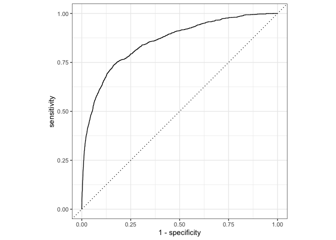

Modeling hotel bookings
================

``` r
# From TidyTuesday: https://github.com/rfordatascience/tidytuesday/blob/master/data/2020/2020-02-11/readme.md
hotels <- read_csv("https://raw.githubusercontent.com/rfordatascience/tidytuesday/master/data/2020/2020-02-11/hotels.csv")
```

## Prepare and peek at the data

``` r
# create little ones
hotels <- hotels %>%
  mutate(
    little_ones = children + babies,
    has_little_ones = if_else(little_ones > 0, "yes", "no")
    ) %>%
  relocate(little_ones, has_little_ones)
```

``` r
# filter for non-cancelled
hotel_stays <- hotels %>%
  filter(is_canceled == 0)

hotels %>%
  count(is_canceled, reservation_status)
```

    ## # A tibble: 3 x 3
    ##   is_canceled reservation_status     n
    ##         <dbl> <chr>              <int>
    ## 1           0 Check-Out          75166
    ## 2           1 Canceled           43017
    ## 3           1 No-Show             1207

``` r
hotel_stays %>%
  count(is_canceled, reservation_status)
```

    ## # A tibble: 1 x 3
    ##   is_canceled reservation_status     n
    ##         <dbl> <chr>              <int>
    ## 1           0 Check-Out          75166

``` r
hotel_stays <- hotel_stays %>%
  select(has_little_ones, hotel, lead_time, arrival_date_month, 
         stays_in_week_nights, adults, meal, required_car_parking_spaces,
         assigned_room_type, market_segment, adr, total_of_special_requests)
```

``` r
glimpse(hotel_stays)
```

    ## Rows: 75,166
    ## Columns: 12
    ## $ has_little_ones             <chr> "no", "no", "no", "no", "no", "no", "no",…
    ## $ hotel                       <chr> "Resort Hotel", "Resort Hotel", "Resort H…
    ## $ lead_time                   <dbl> 342, 737, 7, 13, 14, 14, 0, 9, 35, 68, 18…
    ## $ arrival_date_month          <chr> "July", "July", "July", "July", "July", "…
    ## $ stays_in_week_nights        <dbl> 0, 0, 1, 1, 2, 2, 2, 2, 4, 4, 4, 4, 4, 4,…
    ## $ adults                      <dbl> 2, 2, 1, 1, 2, 2, 2, 2, 2, 2, 2, 2, 2, 2,…
    ## $ meal                        <chr> "BB", "BB", "BB", "BB", "BB", "BB", "BB",…
    ## $ required_car_parking_spaces <dbl> 0, 0, 0, 0, 0, 0, 0, 0, 0, 0, 0, 0, 0, 0,…
    ## $ assigned_room_type          <chr> "C", "C", "C", "A", "A", "A", "C", "C", "…
    ## $ market_segment              <chr> "Direct", "Direct", "Direct", "Corporate"…
    ## $ adr                         <dbl> 0.00, 0.00, 75.00, 75.00, 98.00, 98.00, 1…
    ## $ total_of_special_requests   <dbl> 0, 0, 0, 0, 1, 1, 0, 1, 0, 3, 1, 0, 3, 0,…

``` r
skim(hotel_stays)
```

|                                                  |              |
|:-------------------------------------------------|:-------------|
| Name                                             | hotel\_stays |
| Number of rows                                   | 75166        |
| Number of columns                                | 12           |
| \_\_\_\_\_\_\_\_\_\_\_\_\_\_\_\_\_\_\_\_\_\_\_   |              |
| Column type frequency:                           |              |
| character                                        | 6            |
| numeric                                          | 6            |
| \_\_\_\_\_\_\_\_\_\_\_\_\_\_\_\_\_\_\_\_\_\_\_\_ |              |
| Group variables                                  | None         |

Data summary

**Variable type: character**

| skim\_variable       | n\_missing | complete\_rate | min | max | empty | n\_unique | whitespace |
|:---------------------|-----------:|---------------:|----:|----:|------:|----------:|-----------:|
| has\_little\_ones    |          0 |              1 |   2 |   3 |     0 |         2 |          0 |
| hotel                |          0 |              1 |  10 |  12 |     0 |         2 |          0 |
| arrival\_date\_month |          0 |              1 |   3 |   9 |     0 |        12 |          0 |
| meal                 |          0 |              1 |   2 |   9 |     0 |         5 |          0 |
| assigned\_room\_type |          0 |              1 |   1 |   1 |     0 |        10 |          0 |
| market\_segment      |          0 |              1 |   6 |  13 |     0 |         7 |          0 |

**Variable type: numeric**

| skim\_variable                 | n\_missing | complete\_rate |  mean |    sd |    p0 |  p25 |  p50 | p75 | p100 | hist  |
|:-------------------------------|-----------:|---------------:|------:|------:|------:|-----:|-----:|----:|-----:|:------|
| lead\_time                     |          0 |              1 | 79.98 | 91.11 |  0.00 |  9.0 | 45.0 | 124 |  737 | ▇▂▁▁▁ |
| stays\_in\_week\_nights        |          0 |              1 |  2.46 |  1.92 |  0.00 |  1.0 |  2.0 |   3 |   50 | ▇▁▁▁▁ |
| adults                         |          0 |              1 |  1.83 |  0.51 |  0.00 |  2.0 |  2.0 |   2 |    4 | ▁▂▇▁▁ |
| required\_car\_parking\_spaces |          0 |              1 |  0.10 |  0.30 |  0.00 |  0.0 |  0.0 |   0 |    8 | ▇▁▁▁▁ |
| adr                            |          0 |              1 | 99.99 | 49.21 | -6.38 | 67.5 | 92.5 | 125 |  510 | ▇▆▁▁▁ |
| total\_of\_special\_requests   |          0 |              1 |  0.71 |  0.83 |  0.00 |  0.0 |  1.0 |   1 |    5 | ▇▁▁▁▁ |

## Explore

``` r
# little ones and parking
```

``` r
# little ones and month and hotel type
```

``` r
# ggally
```

## Build models

``` r
hotels_df <- hotel_stays %>%
  mutate(across(where(is.character), as.factor))
```

### Split into training and testing

``` r
set.seed(1234)
hotels_split <- initial_split(hotels_df)

hotels_train <- training(hotels_split)
hotels_test <- testing(hotels_split)
```

### Build a recipe

``` r
hotels_rec <- recipe(has_little_ones ~ ., data = hotels_train) %>%
  # create dummy variables for
  step_dummy(all_nominal(), -all_outcomes()) %>%
  # remove zero variance variables
  step_zv(all_numeric())
```

### Train model

``` r
hotels_mod <- logistic_reg() %>%
  set_engine("glm")

hotels_wflow <- workflow() %>% 
  add_model(hotels_mod) %>% 
  add_recipe(hotels_rec)

hotels_fit <- hotels_wflow %>% 
  fit(data = hotels_train)
```

``` r
hotels_fit
```

    ## ══ Workflow [trained] ══════════════════════════════════════════════════════════
    ## Preprocessor: Recipe
    ## Model: logistic_reg()
    ## 
    ## ── Preprocessor ────────────────────────────────────────────────────────────────
    ## 2 Recipe Steps
    ## 
    ## ● step_dummy()
    ## ● step_zv()
    ## 
    ## ── Model ───────────────────────────────────────────────────────────────────────
    ## 
    ## Call:  stats::glm(formula = ..y ~ ., family = stats::binomial, data = data)
    ## 
    ## Coefficients:
    ##                  (Intercept)                     lead_time  
    ##                   -16.200648                      0.001187  
    ##         stays_in_week_nights                        adults  
    ##                     0.037027                     -0.674563  
    ##  required_car_parking_spaces                           adr  
    ##                     0.240620                      0.011152  
    ##    total_of_special_requests            hotel_Resort.Hotel  
    ##                     0.447703                     -0.863604  
    ##    arrival_date_month_August   arrival_date_month_December  
    ##                     0.309013                      0.558758  
    ##  arrival_date_month_February    arrival_date_month_January  
    ##                     0.620461                      0.344486  
    ##      arrival_date_month_July       arrival_date_month_June  
    ##                     0.380446                     -0.370553  
    ##     arrival_date_month_March        arrival_date_month_May  
    ##                     0.042665                     -0.576900  
    ##  arrival_date_month_November    arrival_date_month_October  
    ##                    -0.335872                     -0.240701  
    ## arrival_date_month_September                       meal_FB  
    ##                    -0.797587                      0.810695  
    ##                      meal_HB                       meal_SC  
    ##                    -0.032469                     -1.260116  
    ##               meal_Undefined          assigned_room_type_B  
    ##                     0.128573                      1.265457  
    ##         assigned_room_type_C          assigned_room_type_D  
    ##                     2.915353                      0.427704  
    ##         assigned_room_type_E          assigned_room_type_F  
    ##                     0.615468                      2.233575  
    ##         assigned_room_type_G          assigned_room_type_H  
    ##                     3.123476                      4.223074  
    ##         assigned_room_type_I          assigned_room_type_K  
    ##                     2.353868                      0.252032  
    ## market_segment_Complementary      market_segment_Corporate  
    ##                    12.862736                     10.722630  
    ##        market_segment_Direct         market_segment_Groups  
    ##                    12.889073                     10.794376  
    ## market_segment_Offline.TA.TO      market_segment_Online.TA  
    ##                    12.557837                     12.837319  
    ## 
    ## Degrees of Freedom: 56374 Total (i.e. Null);  56337 Residual
    ## Null Deviance:       31810 
    ## Residual Deviance: 22490     AIC: 22560

### Make predictions

``` r
hotels_pred <- predict(hotels_fit, hotels_test, type = "prob") %>% 
  bind_cols(hotels_test) 
```

### Evaluate performance

``` r
hotels_pred %>%
  roc_curve(
    truth = has_little_ones,
    .pred_yes,
    event_level = "second"
  ) %>%
  autoplot()
```

    ## Warning: partial match of 'se' to 'sensitivities'

    ## Warning: partial match of 'sp' to 'specificities'

<!-- -->

``` r
hotels_pred %>%
  roc_auc(
    truth = has_little_ones,
    .pred_yes,
    event_level = "second"
  )
```

    ## Warning: partial match of 'se' to 'sensitivities'

    ## Warning: partial match of 'sp' to 'specificities'

    ## # A tibble: 1 x 3
    ##   .metric .estimator .estimate
    ##   <chr>   <chr>          <dbl>
    ## 1 roc_auc binary         0.856
