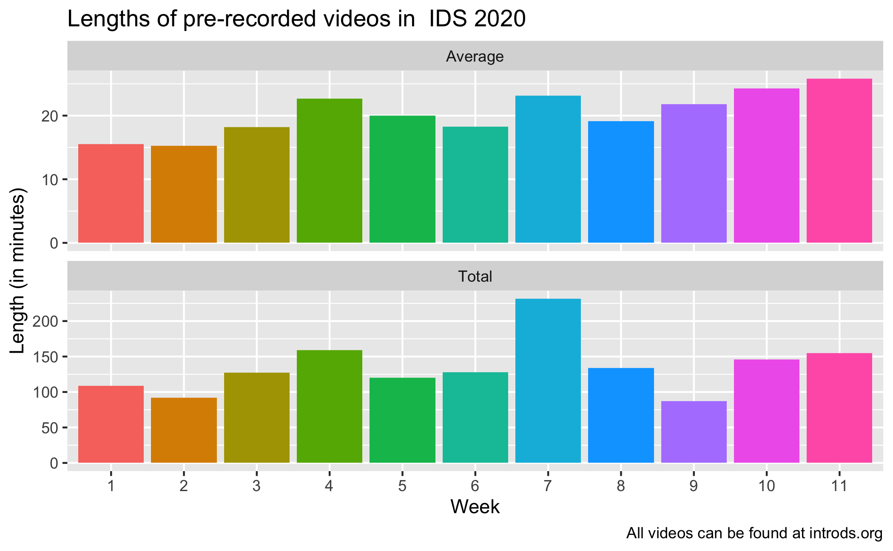
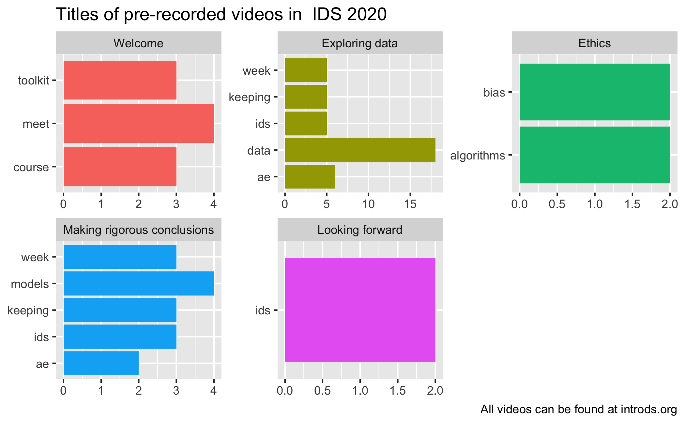

Course videos
================

``` r
videos <- read_excel("videos.xlsx")
```

## Video lengths

``` r
videos %>%
  count(week)
```

    ## # A tibble: 11 x 2
    ##     week     n
    ##  * <dbl> <int>
    ##  1     1     7
    ##  2     2     6
    ##  3     3     7
    ##  4     4     7
    ##  5     5     6
    ##  6     6     7
    ##  7     7    10
    ##  8     8     7
    ##  9     9     4
    ## 10    10     6
    ## 11    11     6

``` r
videos <- videos %>%
  mutate(length = ((min * 60) + sec) / 60)

videos %>%
  group_by(week) %>%
  summarise(
    total = sum(length),
    average = mean(length),
    .groups = "drop"
    ) %>%
  pivot_longer(cols = -week, 
               names_to = "measure_type", 
               values_to = "length",
               names_transform = list(measure_type = str_to_title)
               ) %>%
  mutate(week = as.factor(week)) %>%
  ggplot(aes(x = week, y = length, fill = week)) +
  geom_col() +
  guides(fill = FALSE) +
  facet_wrap(~measure_type, ncol = 1, scales = "free_y") +
  labs(
    title = "Lengths of pre-recorded videos in  IDS 2020",
    x = "Week", 
    y = "Length (in minutes)",
    caption = "All videos can be found at introds.org"
    )
```



## Video content

``` r
videos %>%
  mutate(unit = fct_inorder(unit)) %>%
  unnest_tokens(word, title) %>%
  anti_join(get_stopwords()) %>%
  group_by(unit) %>%
  count(word, sort = TRUE) %>%
  filter(n > 1) %>%
  slice_head(n = 5) %>%
  ggplot(aes(y = word, x = n, fill = unit)) +
  geom_col() +
  guides(fill = FALSE) +
  facet_wrap(~unit, ncol = 3, scales = "free") +
  labs(
    title = "Titles of pre-recorded videos in  IDS 2020",
    y = NULL, 
    x = NULL,
    caption = "All videos can be found at introds.org"
    )
```

    ## Joining, by = "word"


